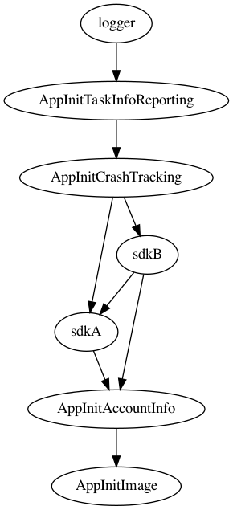

## Star Driver

A library for managing the initialization tasks when an android application startup. It provides a simple way to control the order of tasks.

## Version

- APT/Android Annotation Processor

    https://github.com/succlz123/StarDriver-APT

- Gradle Transform Plugin

    https://github.com/succlz123/StarDriver-Transform

## Work Flow

> The Tasks that need to be initialized in the application.

> Automatically sort is based on before and after dependencies.

## Usage

### Build.gradle

~~~
implementation project(':stardriver-apt-lib')
implementation project(':stardriver-apt-annotation')
annotationProcessor project(':stardriver-apt-processor')
~~~

### Init Task

~~~java
public class AppInitLogger extends IStarDriver {

    @Override
    public void initialize(Context context, StarDriverResult result) {
        try {
          	// simulation initialization code
            Thread.sleep(23);
        } catch (InterruptedException e) {
            result.success = false;
            result.errorMessage = e.toString();
            return;
        }
        result.success = true;
    }
}
~~~

### Setting task priorities

Option 1:

~~~java
public class AppInitTaskHelper {

    // you can add the annotation on the field
    @StarDriverInit(name = "Application logger")
    public AppInitLogger logger;

    @StarDriverInit(name = "Info Report", after = {AppInitLogger.class})
    public AppInitTaskInfoReporting infoReport;
}
~~~

Option 2:

~~~java
// you can also add the annotation on the class
@StarDriverInit(name = "Account Info")
public class AppInitAccountInfo extends IStarDriver {

    @Override
    public void initialize(Context context, StarDriverResult result) {
        try {
            Thread.sleep(10);
        } catch (InterruptedException e) {
            result.success = false;
            result.errorMessage = e.toString();
            return;
        }
        result.success = true;
    }
}
~~~

### Application

~~~java
public class MainApplication extends Application {

    @Override
    public void onCreate() {
        super.onCreate();
      	// The returned results contain the task name and time-taken.
        ArrayList<StarDriverStatisticsResult> results = StarDriverManager.inject(this);
    }
}
~~~

## Plant UML

Copy the output of the build console into the StarDriverDigraph.puml file and install the Plant uml plug-in for Android Studio.

Then you can see the diagram like this.

